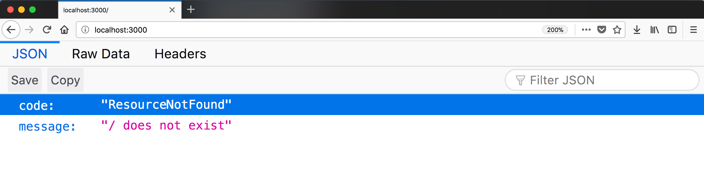
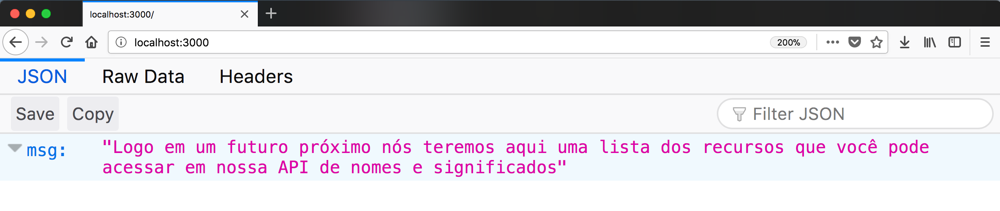

# Índice
1. [Como começar um projeto qualquer em NodeJS](#01-como-começar-um-projeto-qualquer-em-nodejs)
2. [Como criar um servidor HTTP com Restify](#02-como-criar-um-servidor-http-com-restify)
3. [O que é importante saber sobre o HTTP antes de sair codando](#03-o-que-é-importante-saber-sobre-o-http-antes-de-sair-codando)
4. [Como criar uma respota para o path /][#04-como-criar-uma-resposta-para-path-]

# O que você aprenderá no workshop

# Configurações necessário para começar o workshop


# 01. Como começar um projeto qualquer em NodeJS

## Objetivo
Uma vez que você faz a instalação do NodeJS na sua máquina, você instalalou sem perceber um gerenciador de pacote chamado npm (Node Package Manager). Esse gerenciador é similar ao apt-get utilizado no Linux ou o homebrew do Mac, mal mas não sei qual seria o paralelo no Windows.

Vamos utilizar o npm para iniciar o nosso projeto com NodeJS definindo as seguintes propriedades do nosso projeto:
- Nome (package name);
- Versão (version);
- Descrição (description);
- Arquivo que o seu projeto inicia (entry point);
- Script de teste (test command);
- Repositório git (git repository);
- Palavras chaves pra localizar o seu projeto se ele for opensource é uma boa definir isso com cuidado (keyworkds);
- Autor (author);
- Licença, também utilizamos ela em caso de projetos opensource, particulamente gosto de duas licençar MPL-2.0 e Apache2 (license);

**Obs.** O texto que está entre parênteses e em inglês é a chave que o npm usa para guardar essas informações.

## Passo a passo com código

Crie uma pasta com o nome **restify-workshop** na pasta do seu usuário, gosto de fazer isso utilizando o terminal, se você estiver utilizando Linux ou Mac poderá executar os comandos a seguir em seu terminal (desculpa mas faz um bom tempo que não uso Windows e não sei como fazer isso nele):

### Terminal
Para navegar até a pasta do seu usuário:
```
cd ~
```

Para criar a pasta:
```
mkdir restify-workshop
```

Entrar na pasta **restify-workshop**:
```
cd restify-workshop
```

Rodar o comando para definirmos as propriedades do projeto (lembre-se que você tem que estar dentro da pasta **restify-workshop**):
```
npm init
```


Assim que você der o ENTER após o comando você irá começar a responder as peguntas sobre as propriedades do seu projeto, no momento que você terminar de responder essas perguntas, será apresentado um resumo onde você poderá verificar se está tudo certo, uma vez que você confirmar, nesse momento será criado pelo *npm* um arquivo chamado **package.json** e é nesse arquivo que é guardado todas as suas respostas. Vamos falar mais sobre esse arquivo durante os próximos exercícios.

# 02. Como criar um servidor HTTP com Restify

## Objetivo
Criar um servidor HTTP sem utilizar um framework é bem triste e você sofrerá muito, tudo que você sofrerá já foi resolvido pela comunidade por isso usamos um framework como o Restify. Tem outros problemas sobre não usar um framework como mostrei nesse post:
http://blog.caelum.com.br/como-criar-um-servidor-http-com-nodejs

Agora vamos criar um servidor utilizando o Restify que responderá apenas quando o usuário acessar a home em http:localhost:3000

## Passo a passo com código

1. Primeiro vamos instalar o **restify** como uma dependência do nosso projeto. Abra o terminal e o rode o seguinte comando:

## Terminal
```
npm i restify
```

Após rodar esse comando, você verá que no arquivo **package.json** foi adicionado mais uma chave chamada *dependencies*, dentro dessa chave você terá o **restify** com a identificação de qual versão vamos utilizar do **restify**.

## Exemplo de como ficará o seu package.json
```
{
  "name": "restify-workshop",
  "version": "1.0.0",
  "description": "Projeto do workshop de restify do meetup Front End SP",
  "main": "index.js",
  "scripts": {
    "test": "echo \"Error: no test specified\" && exit 1"
  },
  "repository": {
    "type": "git",
    "url": "git+https://github.com/MarcoBrunoBR/restify-workshop.git"
  },
  "keywords": [
    "restify"
  ],
  "author": "Marco Bruno",
  "license": "MPL-2.0",
  "bugs": {
    "url": "https://github.com/MarcoBrunoBR/restify-workshop/issues"
  },
  "homepage": "https://github.com/MarcoBrunoBR/restify-workshop#readme",
  "dependencies": {
    "restify": "^7.1.1"
  }
}
```


2. Crie uma arquivo chamado **index.js** dentro da pasta **restify-workshop**, dentro desse arquivos primeiro precisamos chamar a nossa dependência *restify* e guardar ela em uma variável que não varia (uma constante)chamada *restify*:

### Arquivo index.js
```
const restify = require('restify')
```

3. Em seguida precisamos criar um servidor utilizando o *restify*. Para isso utilizamos o método *createSever()* que é um recurso da nossa variável *restify*, esse método retorna pra gente um servidor que guardaremos dentro da varíavel *server* (servidor). Estamos utilizando o nome das variaveis em inglês porque você será cobrado pelo mercado de trabalho para escrever dessa maneira, por favor não me leve a mal se você não souber inglês eu tiver dificuldade como eu também tenho.

### Arquivo index.js
```
const restify = require('restify')

const server = restify.createServer()
```

4. Infelizmente não estamos com o nosso servidor de pé só criamos ele, para colocar o servidor de pé precisamos chamar o método *liten* que está disponivel na variavel *server*, esse método espera receber dois parâmetros sendo o primeiro a porta e o segundo uma função que será executada no mommento que o servidor estiver disponível, dentro dessa função vamos ter dois *console.log*, um que falará onde o sevidor está de pé e o outro falará como faz para derrubar o servidor. Pra manter a legibilidade do código vamos criar um variável chamada *port* (porta) que guardará a nossa porta com o valor 3000.

### Arquivo index.js
```
const restify = require('restify')
const port = 3000

const server = restify.createServer()

server.listen(port, () => {
  console.log(`Servidor de pé em http://localhost:${port}`)
  console.log('Pra derrubar o servidor: ctrl + c')
})
```

5. Agora que terminamos o nosso código responsável por criar o nosso servidor, por favor abra o seu terminal e navegue até a pasta do nosso projeto (**restify-workshop**) dentro da pasta rode o comando abaixo para que o nosso código seja rodado pela plataforma NodeJS:

### Terminal
```
node index.js
```

Só pra termos certeza que o servidor está de pé vamos até o *browser* (navegador) para acessarmos a URL http://localhost:3000, se você tiver uma resposta parecida com a imagem a seguir está tudo certo apesar de ser uma mensagem de erro:



# 03. O que é importante saber sobre o HTTP antes de sair codando
Esse conteúdo vou deixar pra explicar em aula e deixar você fazer suas anotações, mas vale deixar alguma representação visual sobre como funciona o HTTP:


Pretendo fazer um vídeo explicando como funciona o HTTP e a teoria por trás dele, mas ainda não está feito, por enquanto será a explicação da aula mesmo :-)

# 04. Como criar uma resposta para path /

## Objetivo
Por enquanto quando acessamos a nosso servidor pelo browser no path / recebemos como resposta um erro que o próprio **restify** criou pra nós, queremos trocar essa mensagem padrão com uma resposta que estará no nosso controle. Nessa reposta vamos implementar um JSON com a chave *msg* e o valor será "Logo em um futuro próximo nós teremos aqui uma lista dos recursos que você pode acessar em nossa API de nomes e significados"

## Passo a passo com código
1. Abra o arquivo **index.js**, dentro dele vamos chamar o método *get* que esta disponível na variável *server*, esse método espera receber dois parâmetros sendo o primeiro qual o *path* que estamos mapeando para criar um resposta e o segundo parâmentro é uma função que será executado no momento que o usuário fazer uma requisição do tipo GET para o *path* que informamos no primeiro parâmentro:

### Arquivo index.js
```
const restify = require('restify')
const port = 3000

const server = restify.createServer()

server.get('/', () => {
})

server.listen(port, () => {
  console.log(`Servidor de pé em http://localhost:${port}`)
  console.log('Pra derrubar o servidor: ctrl + c')
})
```

2. Pra que a alteração que nós fizemos no nosso código seja atualizado no nosso servidor precisamos reiniciar o nosso servidor, por isso precisamos ir até o terminal onde temos o nosso servidor de pé e derrubar ele apertando **ctrl + c** e logo em seguida rodar novamente o comando a seguir no terminal para colocarmos o servidor de pé novamente:

### Terminal
```
node index.js
```

Se você tentar acessar o nosso servidor pelo browser verá que estão sem resposta e o nosso browser ficará perdido esperando a resposta do servidor.

3. Dentro da função que passamos como segundo parâmetro para o método *get* precisamos criar a nossa resposta com o JSON que terá a chave *msg* e dentro dessa chave o conteúdo "Logo em um futuro próximo nós teremos aqui uma lista dos recursos que você pode acessar em nossa API de nomes e significados":

### Arquivo index.js
```
const restify = require('restify')
const port = 3000

const server = restify.createServer()

server.get('/', (req, res) => {
  res.send({msg: "Logo em um futuro próximo nós teremos aqui uma lista dos recursos que você pode acessar em nossa API de nomes e significados"})
})

server.listen(port, () => {
  console.log(`Servidor de pé em http://localhost:${port}`)
  console.log('Pra derrubar o servidor: ctrl + c')
})
```

Lembre-se que precisamos reinicair o servidor para que o nosso código seja atualizado, pra isso precisamos ir até o terminal onde nosso servidor está rodando e apertar **ctrl + c** e depois rodar o comando abaixo:

### Terminal
```
node index.js
``` 

Agora se você voltar ao *broser* e acessar http://localhost:3000 verá a seguinte resposta:
